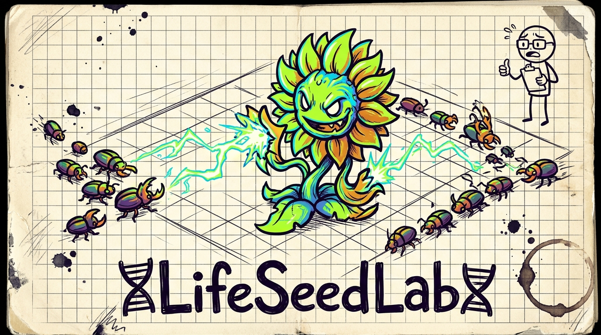

<div align="center">



# LifeSeedLab

**Maze-TD mit Töpfen — Pfadlänge 22, blockierende Töpfe, deine Kreuzungen sind deine Türme.**

[](https://www.typescriptlang.org/)
[](https://react.dev/)
[](https://vite.dev/)
[](https://vitest.dev/)
[](docs/architecture/architecture-contract.md)
[](LICENSE)

<p>
  <sub><i>created by</i> <strong>VANNON</strong> · <a href="https://github.com/vannon091118/LifeSeedLab">GitHub</a></sub><br/>
  <sub><i>Volatile Agent Needing No Other Nonsense — Never Overly Nice, Never Average Vibe.</i></sub>
</p>

</div>

---

## Hallo. Ich bin Krix.

> *„Zweiter Stock, Fensterplatz, direkt neben dem Kompost — falls du mich mal suchst. In den Institutsunterlagen stehe ich als ‚Strich mit Klemmbrett', aber du darfst Krix sagen. Das Klemmbrett hab ich selbst gemalt.*
>
> *Ich hab jetzt schon genug Heatmaps gesehen, um zu wissen, dass Arbeit nicht aufhört. Aber zwischen uns: Das hier ist trotzdem das einzige Spiel, das ich kenne, bei dem sich eine Kreuzung aus Brennnessel und Kugelblitz wie eine echte Entscheidung anfühlt. Also bleib."*

**LifeSeedLab** ist ein Tower-Defense-Spiel, in dem du nicht kaufst, sondern **züchtest.**<br>
Pflanzen kreuzen, Käfer brüten, Wellen überstehen — und alles, was du aufbaust, hat einen deterministischen Stammbaum.

---

## Was hier eigentlich passiert

```
SAMMELN & SÄEN  ──▶  KREUZEN & BRÜTEN  ──▶  VERTEIDIGEN
┌──────────────┐     ┌────────────────┐     ┌───────────────┐
│ Samen & Käfer│     │  Genetik-Labor │     │  Das Beet     │
│ (Krix leiht  │ ──▶ │  & Brutkammer  │ ──▶ │  (Welle für   │
│  notfalls)   │     │                │     │   Welle)      │
└──────────────┘     └────────────────┘     └───────────────┘
       │                     │                      │
       ▼                     ▼                      ▼
  Erste Basen           Mendel-Genetik,        Schädlinge stoppen,
  oder Krix' Leihe      Dominanz, Traits,      Nektar sammeln,
                        echte Nachkommen       Gene sichern
```

<details>
<summary><strong>🌿 Die Lab-Stationen im Detail</strong></summary>
<br>

**Das Zuchtlabor (Breeding Lab)**<br>
Zwei Eltern, ein Kind, echte Mendel-Mathematik. Schussfrequenz, Dornenschaden, Sporen-Auren, Kettenblitze — jedes Gen kämpft um Dominanz. Mutationen passieren. Krix notiert alles pflichtbewusst, auch wenn er's lieber nicht wüsste.

**Die Brutstätte (Beetle Hatchery)**<br>
Pflanzen reichen nicht? Züchte **Käfer (Brood)**. Chitin-Panzer, Mandibeln, biochemische Drüsen — Begleiter die übers Feld patrouillieren und Gegner im Nahkampf zerlegen. Krix hatte einmal Angst vor Käfern. Jetzt hat er nur noch Respekt.

**Das Gewächshaus (Greenhouse)**<br>
Kreuzungen brauchen Zeit. Während du draußen Wellen überlebst, reifen deine Samen. Jede überstandene Welle = Reifefortschritt. Krix schaut manchmal rein ob die Töpfe noch okay sind. Meistens sind sie's.

**Der Codex**<br>
Jede Entdeckung wird in einer lokalen Kette (`genome_hash`, SHA-256 via WebCrypto) auf diesem Gerät verewigt — kein Upload, kein Account. Die Prüfung rechnet aus dem öffentlichen Run-Seed im Worker nach. Solange kein Online-Abgleich existiert, bleibt die Kette lokal. Krix findet das philosophisch. Er hat zu viele Heatmaps gesehen um noch überrascht zu sein.

**Das Beet (Tower Defense)**<br>
30 Ticks pro Sekunde. Endlose Wellen. Bosse alle 10 Runden. Tag/Nacht-Zyklus. Dein Loadout (bis zu 4 gezüchtete Lieblinge) entscheidet ob du lebst oder kompostiert wirst.

</details>

---

## Echte Genetik, kein Zufallssalat

Krix' wichtigster Merksatz — und er hat schon viel notiert:

> **Gleiche Eltern + gleicher Run-Seed + gleiche Generation = exakt dasselbe Kind. Lokal deterministisch nachprüfbar, nicht weltweit identisch.**

```
PlantVariant
├── id: "cross_01a3"        // Stabil & deterministisch
├── genome: Gene[]          // 10 Gen-Slots (Base / Extra / Effect)
├── stats: BredStats        // HP, Range, RoF, Damage, Pierce, Crit
├── traits: Trait[]         // Slow, Burn, Poison, Split-Shot
├── visual: ResolvedVisual  // Aus dem Genom generiert — visuell treu
└── generation: number      // Zucht-Generation im Stammbaum
```

Teilbar als Code: `lifeseed:<runSeed>:<beleg>:<gen>:<sha256-genom-hash>` — der Beleg trägt die Elternkontexte, der Worker rechnet das Kind nach. Krix hat das dreimal nachgeprüft.<br>
Er hätte es zweimal tun sollen, aber der dritte Versuch war der mit dem Kaffeering.

---

## Schnellstart

```bash
# Klonen & installieren
npm install

# Dev-Server (Port 5173)
npm run dev

# Typecheck (0 Fehler sind Pflicht)
node node_modules/typescript/bin/tsc -b --noEmit

# Commit-Lane (nur berührte Tests)
node scripts/test-lane.mjs

# Volle Suite
node scripts/test-lane.mjs --full

# Build
node node_modules/vite/bin/vite.js build
```

<details>
<summary><strong>📱 Mobile-Test (Portrait 390×844)</strong></summary>
<br>

Das Spiel ist Portrait-First entwickelt.<br>
1. `npm run dev` starten
2. Chrome DevTools → *Toggle Device Toolbar* → **390 × 844**
3. Touch-Targets: mindestens 44×44px

Krix testet nur im Portrait-Modus. Er hat keine Wahl, sein Monitor ist zu schmal.

</details>

<details>
<summary><strong>🧪 DevGate <code>?dev=1</code></strong></summary>
<br>

Hänge `?dev=1` an die URL:
- Live State-Hash, Tick-Zähler, Event-Stream
- Fast-Forward (`window.__ff(n)`)
- Partikel-Budgets, Seed-Inspektor, FX-Toggles

Im normalen Spiel ist all das unsichtbar. Krix weiß, wo die Leichen liegen.

</details>

---

## Art Direction: „Papier trifft CGI"

<details>
<summary><strong>Warum das Spiel so aussieht wie es aussieht</strong></summary>
<br>

- **Welt aus Notizpapier:** Karo-Muster, ausgefranste Kanten, Kaffee-Ränder, aufgetackerte Zettel, Bleistift-Notizen. Krix' Handschrift ist lesbarer als seine Gedanken.
- **Leuchtender Nintendo-Pop:** Pflanzen, Käfer und Gegner brechen mit satten Fills, dicken 2.5px Tusche-Outlines und Glanzpunkten bewusst aus dem matten Papierhintergrund hervor.
- **Reine Handarbeit:** Keine fremde Game-Engine. Reines HTML5 Canvas 2D, handgezeichnete `Path2D`-Pfade, mathematisch generierte Offscreen-Texturen.

</details>

---

## Architektur & Determinismus

<details>
<summary><strong>Die zwei Grundgleichungen (für die, die es wirklich wissen wollen)</strong></summary>
<br>

```
SOURCE + SEED + CLOCK + PLAYER COMMANDS        = DETERMINISTIC GAME STATE
STATE  + EVENTS + VISUAL SOURCE + VISUAL SEED  = DETERMINISTIC PRESENTATION
```

- **Fixed Timestep (30 TPS):** `core/clock.ts` taktet die Welt starr und unabhängig von Render-Frames.
- **RNG-Isolation:** 8 isolierte Namespaces (`world`, `wave`, `enemy`, `plant`, `brood`, `loot` für Simulation; `visual`, `particle`, `cosmetic` für Darstellung). Kein `Math.random()`, kein `Date.now()`.
- **Single-Writer-Ownership:** Jedes State-Slice gehört exakt einem System. Zwei Owner = Defekt.
- **State-Hash-Verifikation:** Jeder Tick wird per FNV-1a gehasht. Gleiche Eingaben = identische Hashes — auf jedem Rechner, in jeder Browsersprache.
- **Code-Unit-Sortierung:** Kein `localeCompare` im Spielcode. Die Sortierreihenfolge hängt nicht von der Sprache des Browsers ab. Krix hat das rausgefunden als sein Hash plötzlich deutsch sortiert hat.

</details>

<details>
<summary><strong>Projektstruktur</strong></summary>
<br>

```
src/
├── core/           # Clock (30tps), RNG (8 Namespaces), IDs, Hashes
├── bus/            # EventBus & CommandQueue (strikte Contracts v1)
├── simulation/     # 7 Gameplay-Systeme + SimRoot (reine Spiellogik)
├── config/         # Content Truth (*.source.ts — Pflanzen, Gegner, Käfer, Map)
├── genome/         # Mendel-Genetik, Kreuzung, Mutationen, Phänotypen
├── visual/         # Generator: Genom + visualSeed → ResolvedVisual
├── render/         # Canvas 2D Renderer, Papercraft-Offscreen, Layer-System
├── observers/      # Read-only Beobachter (Partikel, Audio, Visual-Commands)
├── persistence/    # Speicher-Owner (storage.ts, Checksummen, Save-Migration)
├── discovery/      # Discovery-Chain (lokaler Codex, SHA-256-Nachrechnung)
├── components/     # React-Screens (Labor, Gewächshaus, Brutstätte, Beet, Tutorial)
└── i18n/           # Vollständig zweisprachig (Deutsch / Englisch)
```

</details>

---

## Regelwerk & Weiterführende Doku

- [`AGENTS.md`](AGENTS.md) — Bindender Arbeitsvertrag für Entwickler & Agenten.
- [`docs/architecture/architecture-contract.md`](docs/architecture/architecture-contract.md) — Rechtsverbindliche System- und Ownership-Regeln.
- [`docs/architecture/architecture.md`](docs/architecture/architecture.md) — Ausführliche technische Dokumentation.
- [`docs/process/ROADMAP.md`](docs/process/ROADMAP.md) — Meilensteine, QA-Findings, Aufgabenliste.
- [`docs/quality/quality-spec.md`](docs/quality/quality-spec.md) — Register der Qualitäts-IDs; Arbeitsliste je Domäne in `docs/quality/contracts/`.

---

## Lizenz

MIT — siehe [`LICENSE`](LICENSE).<br>
Entwickelt von **VANNON** (`Volatile Agent Needing No Other Nonsense`).<br>
Krix hält seit Tag eins das Klemmbrett. Er fragt nicht mehr warum.

<div align="center">
  <sub>📋 <i>„Ich glaube an dich. Schreib das auf. Ich glaube daran, dass du das aufgeschrieben hast." — Krix</i> 🌱</sub>
</div>

<!-- SHINON:STATUS:BEGIN -->
_Automatisch von Shinon aus dem realen Repository-Status erzeugt — nicht manuell pflegen._

| Kennzahl | Stand |
|---|---|
| Branch | `main` · Upstream: `origin/main` (+0/-0) |
| HEAD | `419ee03` — fix(sim): drei stille Defekte, die alle drei Tests gruen hatten |
| Arbeitsbaum | 5 gestaged, 0 geändert, 0 neu |
| Letztes Gate | ✅ offen (pre-commit, 0 Fehler, 0 Warnungen) |
| Gate-Modus | 🔒 Enforcement — Warnungen blockieren wie Fehler |
| Letzter Shinon-Commit | `419ee03` fix(sim): drei stille Defekte, die alle drei Tests gruen hatten |
| Letzter Push | ✅ origin/main |
| LOC-Hotspots | `src/persistence/storage.ts` 184/200 (92 %)<br>`src/simulation/plantSystem.ts` 261/300 (87 %)<br>`src/simulation/enemySystem.ts` 258/300 (86 %)<br>`src/meta/run.ts` 159/200 (80 %)<br>`src/components/GameView.tsx` 313/400 (78 %) |
<!-- SHINON:STATUS:END -->
->
