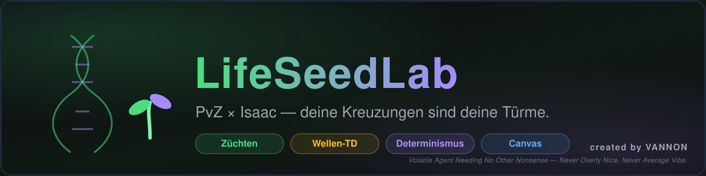

<div align="center">



# LifeSeedLab

**PvZ × Isaac — deine Kreuzungen sind deine Türme.**

[](https://www.typescriptlang.org/)
[](https://react.dev/)
[](https://vite.dev/)
[](https://vitest.dev/)
[](docs/architecture/architecture-contract.md)
[](LICENSE)

<p>
  <sub><i>created by</i> <strong>VANNON</strong> · <a href="https://github.com/vannon091118/LifeSeedLab">GitHub</a></sub><br/>
  <sub><i>Volatile Agent Needing No Other Nonsense — Never Overly Nice, Never Average Vibe.</i></sub>
</p>

</div>

---

## 🎮 Was ist LifeSeedLab?

LifeSeedLab ist ein **Browser-Tower-Defense**, bei dem du **Pflanzen züchtest statt kaufst**. Aus wenigen Grundsorten entstehen durch deterministische Kreuzungen immer neue Varianten mit eigenen Genomen, Traits und Stats — und diese Nachkommen sind deine Türme gegen prozedural generierte Gegnerwellen.

| Feature | Beschreibung |
|---|---|
| 🌱 **Züchten & Entdecken** | Genome kreuzen, Mutationen entdecken, Sammlung aufbauen — 10 Basen × 10 Extras × 10 Effekte |
| 🌊 **Endless Waves** | Unendliche, seed-basierte Wellen mit Bossen alle 10 Wellen; Tag/Nacht-Zyklus |
| 🧬 **Emergente Vielfalt** | Visuell generiert, nie hardgecodet — jede Pflanze ist einzigartig und ihrem Genom treu |
| ⚖️ **Beweisbarer Determinismus** | Gleicher Seed + gleiche Commands = identischer Spielstand (per State-Hash prüfbar) |
| 🍯 **Nektar-Wirtschaft** | Persistentes Roguelike-Geld über Runs hinweg für Shop & Zucht |
| 🇩🇪🇬🇧 **Vollständige i18n** | Deutsch/Englisch — alle Texte, auch im Spiel |

---

## 🎯 Kernkonzept in 30 Sekunden

```
┌─────────────────────────────────────────────────────────────────┐
│  1. SAMMELN          2. ZÜCHTEN           3. VERTEIDIGEN       │
│  ┌─────────┐        ┌─────────┐         ┌─────────┐            │
│  │ Basen   │  ──▶   │ Kreuzung│  ──▶    │ Deine   │            │
│  │ finden  │        │ Genome  │         │ Türme   │            │
│  └─────────┘        └─────────┘         └─────────┘            │
│       │                  │                   │                  │
│       ▼                  ▼                   ▼                  │
│  10 Grund-           Dominante/           Einzigartige        │
│  Pflanzen            Rezessive            Stats, Traits,      │
│  (Shooter,           Gene, Mutationen     Visuelle Identität  │
│   Wall, Support)     → neue Varianten     → Endless Defense   │
└─────────────────────────────────────────────────────────────────┘
```

**Der Clou:** Jede Zucht ist deterministisch. Gleiches Elternpaar + gleicher Seed = **exakt dasselbe Kind** — weltweit reproduzierbar, teilbar via `lifeseed:<seed>:<gen>:<hash>`.

---

## 🏗️ Architektur — Warum das stabil läuft

Das Projekt folgt einem **bindenden Architekturvertrag** ([`architecture-contract.md`](docs/architecture/architecture-contract.md)) mit harten Regeln:

### Die zwei Endgleichungen

```
SOURCE + SEED + CLOCK + PLAYER COMMANDS = DETERMINISTIC GAME STATE
STATE  + EVENTS + VISUAL SOURCE + VISUAL SEED = DETERMINISTIC PRESENTATION
```

### Ownership-Karte (Single Writer pro Slice)

| Slice | Owner (Writer) | Verantwortung |
|---|---|---|
| ⏱️ **Spielzeit** | `core/clock.ts` | Fixed-Timestep 30 Ticks/s, Phase (Tag/Nacht) |
| 🎲 **RNG** | `core/rng.ts` | Einzige Zufallsquelle, 8 Namespaces, `deriveSeed` |
| 🌱 **Pflanzen** | `simulation/plantSystem.ts` | Spawn, Platzierung, Attacke, Schaden |
| 🐛 **Gegner** | `simulation/enemySystem.ts` | Bewegung, Targeting, Schaden, Tod |
| 🏹 **Projektile** | `simulation/projectileSystem.ts` | Flug, Treffer, Effekte (Pierce, Chain, Slow…) |
| 💰 **Energie/Score** | `simulation/scoreSystem.ts` | Nektar, Wellen-Belohnungen, Combo-Multiplikator |
| ⚡ **Combo** | `simulation/comboSystem.ts` | Count, Timer, Multiplier (1–5×) |
| 🌊 **Wellen** | `simulation/waveSystem.ts` | Schedule, Spawns, Boss-Wellen |
| 🧠 **SimState** | `simulation/root.ts` | Zentrale Instanz, Worker-kompatibel |
| 📦 **Content** | `config/*.source.ts` | **SOURCE = CONTENT TRUTH** — keine Constants im Code |
| 🎨 **Visuals** | `visual/generator.ts` | `visualSeed + Source = ResolvedVisual` |
| 🖼️ **Render** | `render/` | Canvas-Layer 0–8, Camera (Observer-owned) |
| ✨ **Observer** | `observers/` | Event→FX, Partikel-Pool, Audio (read-only!) |
| 💾 **Persistenz** | `persistence/storage.ts` | Ein Owner, Checksummen, Migration, Quarantäne |

**Goldene Regeln:**
- 🚫 Gameplay ≠ Rendering — Canvas/React **schreiben nie** Gameplay-State
- 🚫 Graphics = Observers — Partikel/Shader entscheiden **nichts** über Gameplay
- 🚫 Source = Content Truth — **keine** Gameplay-Konstanten außerhalb `config/`
- 🚫 Bus = Handover — Systeme rufen sich **nie direkt** auf (nur Events/Commands)
- 🚫 Kein `Math.random` / `Date.now` in Spiellogik

---

## 🚀 Schnellstart

```bash
# Abhängigkeiten installieren
npm install

# Dev-Server (Port 5173, auf 0.0.0.0 für Mobile-Test)
npm run dev

# Type-Check (muss 0 Fehler sein)
npm run typecheck

# Test-Suite (282 Tests, alle grün)
npm test

# Produktions-Build
npm run build

# Preview des Builds
npm run preview
```

### Mobile Testen (Portrait 390×844)
```bash
npm run dev
# Dann im Browser: Device Toolbar → iPhone 12/13/14 Pro (390×844)
# Oder: Chrome DevTools → Toggle Device Toolbar → Responsive → 390×844
```

---

## 🧪 Determinismus live prüfen

Das ist das Herzstück — du kannst es **jetzt** verifizieren:

1. **Run starten** — Seed wird aus Master-Seed + Run-Nummer abgeleitet
2. **DevGate öffnen** — URL `?dev=1` anhängen oder `#dev` im Hash
3. **State-Hash beobachten** — wird live im Dev-Panel angezeigt
4. **FX ausschalten** — Gameplay-State bleibt **bit-identisch**
5. **Gleicher Seed + gleiche Züge** → gleicher Hash, gleiche Entity-IDs, gleicher Wellenverlauf

```ts
// Beispiel: State-Hash im DevGate
State Hash: 0x3f2a1c9e (tick 1247)
Run ID:     42
Seed:       lifeseed:0x7a3f:42:0x3f2a1c9e
```

---

## 📁 Projektstruktur (Kurzüberblick)

```
src/
├── core/           # Clock, RNG, IDs, Hash — das deterministische Fundament
├── bus/            # EventBus, Commands, Contracts (v1, versioniert)
├── simulation/     # 6 Owningsysteme + Root + State
├── config/         # SOURCE FILES — Content Truth (Plants, Enemies, Effects…)
├── visual/         # Generator: Genome → ResolvedVisual (nur visual-Namespace)
├── render/         # Canvas 2D, Layers 0–8, Camera
├── observers/      # VisualObserver, ParticlePool, AudioObserver
├── persistence/    # storage.ts (Owner), meta.ts, runSave.ts
├── discovery/      # Genome-Hash-Chain (Blockchain-lite, lokal-first)
├── genome/         # Kreuzung, Mutation, Naming, Gacha
├── components/     # React Screens (Start, Menu, GameView, Breeding, Codex…)
├── i18n/           # DE/EN, Context, persisted in Meta
└── App.tsx         # Router + Run-Initialisierung
```

---

## 🧬 Zucht-System — Deep Dive

### Genom-Struktur
```
PlantVariant
├── id: "cross_01a3"          // stabil, deterministisch
├── genome: Gene[]            // 10 Gene-Slots (Base/Extra/Effect)
├── stats: BredStats          // hp, dmg, range, rof, pierce, crit…
├── traits: Trait[]           // "burn", "slow", "heal_aura"…
├── visual: ResolvedVisual    // aus Generator (deterministisch!)
└── generation: number        // Zucht-Generation (persistiert)
```

### Kreuzen (vereinfacht)
```ts
// In genome/beetle.ts
function crossGenomes(a: Genome, b: Genome, seed: string): Genome {
  const rng = deriveSeed(rootSeed, 'plant', a.id, b.id, generation);
  // 1. Slot-Weise Dominanz/Rezessivität
  // 2. Mutations-Chance pro Slot (gewichtet)
  // 3. Name generieren (Silben aus names.source.ts)
  // → Kind-Genom ist deterministisch ableitbar
}
```

### Visuelle Identität aus Genom
```ts
// visual/generator.ts
function genomeToVisualInput(variant: PlantVariant, visualSeed: string): VisualInput {
  // Base → Extra → Effect Tint
  // Jede Entscheidung via deriveSeed(visualSeed, ...)
  // Gleiches Genom + gleicher Seed = identisches ResolvedVisual
}
```

---

## 💾 Persistenz & Resume

### Zwei Stores, ein Owner (`persistence/storage.ts`)

| Store | Backend | Inhalt | Sync? |
|---|---|---|---|
| `meta` | localStorage | Sprache, Nektar, Stats, Sammlung, Loadout, `runId`, `breedGeneration` | **Ja** (vor erstem Render) |
| `run` | localStorage (MVP) → IndexedDB | Run-Snapshot v2 | Nein (async ok) |

### Resume-Vertrag (ehrlich & testbar)
- **Gespeichert:** `{ version, runId, seed, tick, waveNumber, phase:'prep', energy, lives, score, combo, plants[], inventory, nektarEarned }`
- **NICHT gespeichert:** enemies, projectiles, schedule
- **Resume:** State in `prep` wiederaufbauen → nächster Wave-Start regeneriert Schedule deterministisch aus `(seed, waveNumber+1)`
- **Begründung:** Fortlaufende Gegner exakt wiederherstellen = Event-Log-Replay (out of scope). Wellen-Neustart ist der ehrliche, testbare Vertrag.

---

## 🔬 Discovery-Chain — Teilen ohne Blockchain

```
Eltern A + B + Seed → Kind Genom → FNV-1a Hash → genome_hash
                                                      ↓
                              prev_hash (Kette) ← entry_hash
                                                      ↓
                                    lifeseed:<seed>:<gen>:<genome_hash>
```

- **Append-only, hash-linked, lokal-first**
- `UNIQUE(genome_hash)` lokal & remote (Supabase Spiegel) — erste Entdeckung gewinnt dauerhaft
- **Teilen:** `lifeseed:0x7a3f:3:0x3f2a1c9e` → jeder kann exakt dieselbe Pflanze sehen
- Kein Wallet, kein Token, keine Energie — nur Mathematik

---

## 🎨 Art Direction — "Papier trifft CGI"

> **Binding Contract** (siehe `docs/quality/quality-spec.md` B0, B9, B10)

| Ebene | Stil | Technik |
|---|---|---|
| **Welt** | Schul-Mathe-Collageblock | Blaues Raster auf `CELL_SIZE`, Blockrand + Lochung, Bleistift-Kritzeleien, Collage-Fetzen — **einmalig gebacken** (visual-Namespace) |
| **Wege** | Aufgeklebte Papierstreifen | Drop-Shadow, ausgefranste Kanten, Fineliner-Rasterpunkte, Trittsteine |
| **UI** | Notizzettel / Post-its | `#f5efdc` Fill, `#2b2b26` Ink-Border 2px, 3px Hard-Shadow, Büroklammern — **kein Blur-Glass** |
| **Pflanzen/Gegner** | Nintendo-Pop auf Papier | Satte Fills, 2-Stopp-Verläufe, Specular-Highlights, 2.5px Ink-Kontur — **brechen bewusst aus** der matten Welt |
| **Animation** | Papier-Juice | Squash & Stretch, Papierschnipsel-Konfetti, Idle-Atmen/Schwanken — alles Observer/Feedback-Layer |

**Skala ist Genom-Aussage:** `ResolvedVisual.scale = 0.85 + strength·0.3 ± 0.05` (geklemmt 0.85–1.25), deterministisch, test-locked.

---

## 🧪 Tests & Qualitätssicherung

```bash
# Komplette Suite
npx vitest run

# Nur Core (Clock/RNG/IDs/Hash)
npx vitest run src/core

# Mit Coverage
npx vitest run --coverage

# E2E (Playwright)
npm run test:e2e
```

### Abgedeckte Gates
- ✅ Clock-Determinismus (Fixed-Step, Phase-Flips)
- ✅ RNG-Isolation pro Namespace (Gameplay ↔ Presentation)
- ✅ Seed-Derivation & ID-Sequenzen
- ✅ State-Hash (Identität über Runs)
- ✅ Event/Command-Contracts (Schema v1)
- ✅ Sim-Integration (Seed+Commands → Hash)
- ✅ Source-ID-Validierung (alle IDs eindeutig)
- ✅ Visual-Determinismus (Generator)
- ✅ Observer-Purity (keine State-Mutation)
- ✅ Partikel-Budgets (Normal/Busy/Chaos)

### Umgesetzte Gates (quality-spec.md B13)
- ✅ Combo×Score Integration
- ✅ Effect-Profil Cross-Reference Gate
- ✅ Resume-Shape Contract
- ✅ Breeding-Determinismus über `breedGeneration`
- ✅ Meta-Migration v1/v2 → v3
- ✅ Day/Night Event Emission
- ✅ Placement-Rules + Controller (pointer-only, test-locked)
- ✅ Identitäts-Gate: monotone Entitäts-Kennungen (B14, `MetaSave` v5 + Migration)
- ✅ Kanonische Save-Checksumme (key-sortiert, Alt-Saves bleiben lesbar)
- ✅ Genom-Mutation: Fremdgen, Stärke-Jitter, Dominanz-Drift (A15, `src/genome/cross.test.ts`)
- ✅ Encoding-Gate: kein Mojibake, keine Ersatzzeichen in `src/` (A16, `src/encoding.test.ts`)
- ✅ E2E (Playwright, 6 Spezifikationen / 27 Tests in `tests/`): Router, Platzierung, Run-Screen, Preview 390×844, Mechanik, Progression — gemeinsamer Harness (`tests/helpers/harness.ts`, B24)

- ✅ Spielerbericht-Runde 1 (B21–B23): Onboarding „Krix“ (drei Screens), Erst-Anzeige der Tray, **Aufbauphase** (leeres Feld startet keine Welle), phasenrichter Wellen-Knopf, **sichtbare Ablehnungsgründe** (FieldToast), Score gerundet
- ✅ Spielerbericht-Runde 2 (B25): **Haltbarkeitsleiste** am Feld (Verwelken ist sichtbar, Gelb = geschwächt), Loadout-Zähler aus einer Quelle mit der Liste, Codex als ehrliches Laborbuch („bleibt auf diesem Gerät“)
- ✅ Version als eine Quelle (`src/version.ts` ← `package.json`, test-gelockt)
- ✅ E2E-Harness als eine Quelle (B24) — Progression-Laufzeit ~5 min → ~31 s

> **Offen (B16, spezifiziert, teilweise umgesetzt):** Genom-Modell schärfen (B16.2–B16.5),
> E2E-Geometrie vom Renderer lesen (B16.9). Route sichtbar (B16.1) ist erledigt. Offen aus den
> Spielerberichten: Platzierungs-Zuverlässigkeit am Touch-Pfad (Messung steht aus),
> Reichweiten-Kreis/Kampfwerte (Neubau), Brutstätte-Einstieg (Balance).

---

## 🧭 Projektstatus

Diese Tabelle wird von **Shinon** aus dem realen Repository-Zustand erzeugt (`node git-noir/shinon/cli.ts prepare`) und vor jedem Commit aktualisiert — sie ist Messwert, keine Behauptung.

<!-- SHINON:STATUS:BEGIN -->
_Automatisch von Shinon aus dem realen Repository-Status erzeugt — nicht manuell pflegen._

| Kennzahl | Stand |
|---|---|
| Branch | `main` · Upstream: `origin/main` (+0/-0) |
| HEAD | `e490942` — test(maze): B38 — PLANT_ROUTE_COST greift identisch auf loan_sprout |
| Arbeitsbaum | 5 gestaged, 3 geändert, 0 neu |
| Letztes Gate | 🛑 geschlossen (preflight, 0 Fehler, 1 Warnungen) |
| Gate-Modus | 🔒 Enforcement — Warnungen blockieren wie Fehler |
| Letzter Shinon-Commit | `e490942` test(maze): B38 — PLANT_ROUTE_COST greift identisch auf loan_sprout |
| Letzter Push | ✅ origin/qa-reports |
| LOC-Hotspots | `src/simulation/root.ts` 288/300 (96 %)<br>`src/persistence/storage.ts` 191/200 (96 %)<br>`src/simulation/enemySystem.ts` 279/300 (93 %)<br>`src/components/Greenhouse.tsx` 366/400 (92 %)<br>`src/render/gameRuntime.ts` 364/400 (91 %) |
<!-- SHINON:STATUS:END -->


## 🔧 Naming Conventions & Pre‑Commit Check

To avoid naming collisions, all files under `src/` must use a domain‑specific prefix in their filename:
`<domain>_<descriptiveName>.[ts|tsx]` (e.g. `beetle.test.ts` → `genome_beetle.test.ts`).

A local helper script (check-duplicate-basenames, in the ignored tooling folder scripts/) verifies that no two files share the same basename (without extension). It is intentionally not part of the repository — run it locally.

Example pre‑commit setup (using husky or plain Git hook):
```bash
# .git/hooks/pre-commit
#!/usr/bin/env bash
"$PWD/scripts/check-duplicate-basenames.sh"
```
---

## 🗺️ Roadmap & Arbeitsliste

Die verbindliche Arbeitsliste liegt in [`docs/quality/quality-spec.md`](docs/quality/quality-spec.md) (Part A: Befunde, Part B: Specs B0–B13).
Der Stand der Meilensteine steht in [`docs/process/ROADMAP.md`](docs/process/ROADMAP.md).

| Phase | Fokus | Status |
|---|---|---|
| **B14–B19** | Korrektheit: Run-Identity, Persistenz, Zucht-Schleife, E2E-Suite | ✅ Erledigt |
| **B20–B25** | Onboarding (Krix), Spielerbericht-Fixes (Aufbauphase, Feedback, Zähler), Test-Harness | ✅ Erledigt |
| **B16-Rest + Messschiene** | Genom-Modell, Touch-Zuverlässigkeit, Kampfwerte-Lesbarkeit | 🔄 Offen |
| **B12/B13** | Mobile Performance + DoD | ⏳ Geplant |

**Ausführungsreihenfolge:** Sequenziell — Gate rot ⇒ STOP, Ursache lokalisieren, Owner identifizieren, fixen, Test wiederholen.

---

## 🛠️ Entwicklung

### Code-Standards
- **Sprache:** Deutsch (Dokumentation, Commits, Kommentare)
- **TypeScript:** `strict: true`, keine `any`-Lecks
- **LOC-Caps:** 300 (Sim/Core) / 400 (Render/Observer/UI) / 200 (Types/Config/Meta) — **hart**
- **Architektur-Check:** Vor jedem Schreiben die 8-Fragen-Sperre (Contract §10)

### Verifizierung vor jedem Commit (CI-lokal)
```bash
npx tsc -b --noEmit      # Typecheck: 0 Fehler
npx vitest run           # Tests: alle grün
npx vite build           # Build: durchlaufen
```

### DevGate (`?dev=1` / `#dev`)
Alle Entwicklerwerkzeuge leben **nur** hinter dem DevGate:
- State-Hash, Tick, Event-Log (letzte 20)
- Partikelzähler/Budget, Seed + RunId
- FX Toggle, RNG Draw-Counter
- Entity Inspector (ID, VariantKey, Visual Seed, Palette)

**Release-Build zeigt nichts davon.**

---

## 📚 Dokumentation

| Dokument | Zweck |
|---|---|
| [`docs/architecture/architecture-contract.md`](docs/architecture/architecture-contract.md) | Rechtsverbindlicher Vertrag (Regeln, Ownership, Caps, Seeds) |
| [`docs/architecture/architecture.md`](docs/architecture/architecture.md) | Technische Architektur, Stack-Entscheidungen, Datenfluss |
| [`docs/quality/quality-spec.md`](docs/quality/quality-spec.md) | Forensischer Scan + Asset/Render-Spec (Arbeitsliste B0–B13) |
| [`docs/process/ROADMAP.md`](docs/process/ROADMAP.md) | Projektstatus, Dokumentationskarte, nächste Meilensteine |
| [`AGENTS.md`](AGENTS.md) | Agenten-Regeln, Arbeitsmodus, DoD-Checkliste |

---

## 🤝 Beitragen

Das Projekt folgt einem strikten **Architekturvertrag**. Bevor du Code schreibst:

1. **Lese** `AGENTS.md` + `docs/architecture/architecture-contract.md` + `docs/architecture/architecture.md`
2. **Prüfe** die Ownership-Tabelle — gibt es schon einen Writer für deinen Slice?
3. **Suche** nach bestehender Implementierung (`rg --files`, `rg "symbol"`)
4. **Wende** die 8-Fragen-Sperre an (Contract §10)
5. **Schreibe** Tests zuerst (TDD), dann Implementation
6. **Verifiziere** lokal: `tsc`, `vitest`, `vite build`

> **Nie** `vite.config.ts` anfassen (Plattform-managed).  
> **Nie** Dependencies ohne dokumentierte Begründung + Katalog-Prüfung hinzufügen.

---

## 📄 Lizenz

MIT License — siehe [`LICENSE`](LICENSE) (falls vorhanden, sonst Standard-MIT).

---

## 🙏 Credits

- **Architektur & Code:** Buffy (Codebuff Agent) + Human-in-the-loop
- **Engine:** Keine — Canvas 2D, handgeschrieben, deterministisch
- **Fonts:** Gaegu / Patrick Hand (via @fontsource, gebündelt, kein CDN)
- **Icons:** Eigenes SVG-Icon-Set (`ui/icons.tsx`)

---

<div align="center">

**LifeSeedLab** — wo deine Kreuzungen die Türme sind.

*Built with deterministic love 🌱*

</div>