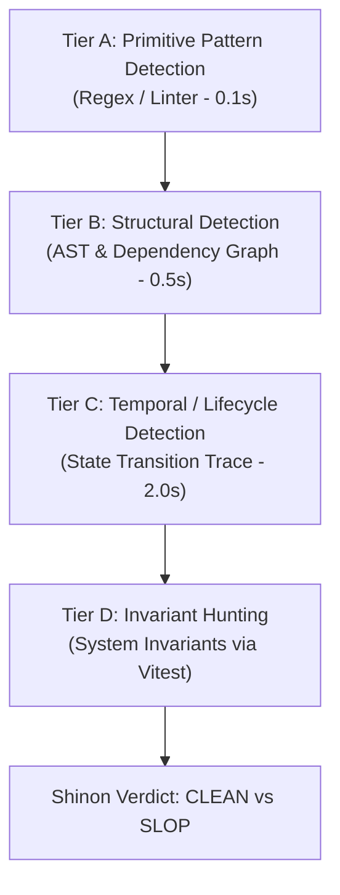

# Shinon Audit-Spezifikation: LLM-Slop, Redundanz & Invarianten-Detektion (LifeSeedLab)

> **Autoritative Prüf- und Erkennungsspezifikation für Shinon & Agenten-Audits.**
> Basierend auf empirischen Analysen von 304.362+ AI-Commits, OWASP Top 10:2025, TypeScript/React-Spezifikationen und der LifeSeedLab Systemarchitektur ([AGENTS.md](../../AGENTS.md), [architecture-contract.md](../architecture/architecture-contract.md)).

---

## Executive Summary & Forschungskontext

Aktuelle empirische Studien zur Qualität von KI-generiertem Code belegen eindeutig, dass der gefährlichste „LLM-Slop“ selten aus offensichtlich hässlichen Syntaxfehlern besteht. Stattdessen erzeugen LLMs lokal plausiblen Code, der bestehende Wiederverwendungsstrukturen umgeht, redundante Wahrheiten einführt oder defensive Schutzschichten über gebrochene Systeminvarianten legt.

- **Empirische Repository-Studie (arXiv:2603.28592):** Eine Großuntersuchung von 304.362 verifizierten AI-authored Commits aus 6.275 Repositories identifizierte 484.606 eingeführte Probleme; 89,1 % davon waren Code Smells, und 24,2 % der AI-eingeführten Probleme bestanden in der aktuellsten Repository-Version fort.
- **Code Reuse & Redundanz (arXiv:2601.21276):** LLM-Agenten ignorieren bestehende Code-Reuse-Möglichkeiten signifikant häufiger als menschliche Entwickler und erzeugen dadurch eine stetig steigende strukturelle Redundanz.
- **LLM Code Bug Taxonomie (arXiv:2403.08937):** 333 analysierte AI-Codefehler zeigten zehn dominante Fehlerklassen: *Missing Corner Cases, Wrong Input Type, Hallucinated Objects, Wrong Attributes, Incomplete Generation, Unnecessary Logic* und *Prompt-Distorted Implementation*.
- **Training-Data & Deprecated APIs (arXiv:2406.09834):** Durch historische Trainingsdaten liegt die Rate veralteter API-Nutzung bei LLM-Generierungen empirisch zwischen 25 % und 38 %.
- **Test-Orakel-Fehlverhalten (arXiv:2410.21136):** LLMs neigen dazu, Test-Orakel zu generieren, die das *tatsächlich vorhandene* (potentiell fehlerhafte) Verhalten spiegeln, anstatt das fachlich erwartete Verhalten unabhängig zu spezifizieren.
- **OWASP Top 10:2025 (A10 Mishandling of Exceptional Conditions):** Das Maskieren von Ausnahme- und Beschädigungszuständen als gültige Rückgabewerte („Failing Open“) wird 2025 ausdrücklich als kritische Sicherheits- und System-Schwachstelle geführt.

Diese Spezifikation beschreibt 22 Audit-Themen für das Werkzeug **Shinon**. Die automatisierte Gate-Konfiguration enthält dafür aktuell sieben konkrete `forbiddenPatterns`; die übrigen Themen bleiben manuelle bzw. nachzurüstende Prüfungen.

---

## Teil 1: Konkrete Erkennungsmuster & Repository-Beweisführung

### 1. Duplicate Truth vs. Duplicate Code (Semantische Wahrheit-Duplikation)

- **Forschungskontext:** LLMs kopieren selten identische Codeblöcke 1:1. Sie schreiben stattdessen dieselbe fachliche Domänenregel oder Entität unter verschiedenen Namen, Datentypen oder Feldmappungs-Strukturen neu (arXiv:2601.21276).
- **Audit-Prüffrage:** *Existieren mehrere Modelle, Schreibweisen oder Umrechnungsketten für dieselbe fachliche Entität oder Regel?*
- **Shinon-Detektionslogik:** AST-Namensgraphen-Vergleich von Typ-Aliasen, Config-Keys und State-Slices. Treffer bei: `gleiche Entität + verschiedene Namen + ähnliche Felder + Konvertierungskette`.
- **Empirischer Befund in LifeSeedLab:**
  - `state.wave.number` ([state.ts](../../src/simulation/state.ts#L136)) vs `RunSnapshot.waveNumber` ([runSave.ts](../../src/persistence/runSave.ts#L26)) vs `pendingRun.waveNumber` ([App.tsx](../../src/App.tsx#L203)) vs `clock.waveTime` ([clock.ts](../../src/core/clock.ts#L10)).
  - **Bewertung:** *False Positive bezüglich Mutations-Konflikt.* Das Schema `wave.number` ist die reine Simulations-Wahrheit. `RunSnapshot.waveNumber` ist die serialisierte Persistenz-Form an der Boundary. 
  - **Systeminvariante:** Nur `SimulationRoot` darf `state.wave` verändern. Serialisierer an den Grenzen dürfen den Begriff transformieren, sofern kein zweiter Writer entsteht.

### 2. Shadow Owner (Mehrere Mutatoren für denselben Zustand)

- **Forschungskontext:** Verteilung von Schreibrechten für denselben Domänenwert über mehrere Funktionen oder UI-Komponenten zerstört die deterministische Zustandskontrolle.
- **Audit-Prüffrage:** *Gibt es genau einen autoritativen Mutationsweg oder haben mehrere Funktionen eigene Schreib-Wahrheiten?*
- **Shinon-Detektionslogik:** Single-Writer AST-Analyse. Prüft alle Zuweisungen (`state.x =`, `setX()`, `updateX()`) gegen die Ownership-Tabelle aus [architecture-contract.md](../architecture/architecture-contract.md) §3.
- **Empirischer Befund in LifeSeedLab:**
  - `src/simulation/enemySystem.ts` ist exklusiver Writer für `enemies`, `biteIntents` und Biss-Geometrie (`reach² = 1.1025`).
  - In [gameRuntime.ts](../../src/render/gameRuntime.ts#L211) ruft ein Event-Subscriber `advanceCrossMaturation(1)` bei `WAVE_STARTED` auf.
  - **Bewertung:** *True Negative.* `advanceCrossMaturation` mutiert Meta-Fortschritt (`meta/economy.ts`) als Reaktion auf ein Bus-Event. Der Gameplay-Simulationszustand (`SimState`) bleibt zu 100 % im Besitz von `SimulationRoot` und seinen registrierten Systemen.

### 3. Event Echo & Datenfluss-Zyklen

- **Forschungskontext:** `Command -> Mutation -> Event -> Listener -> Mutation`. Wenn ein Event-Listener denselben Zustand verändert, den der Emittent gerade verändert hat, entsteht ein verdeckter Zirkelschluss.
- **Audit-Prüffrage:** *Wer emittiert das Event? Wer hört zu? Verändert ein Listener den Zustand, den der Emittent gerade verändert hat?*
- **Shinon-Detektionslogik:** Statische Datenflussgraphen-Analyse (Emitter-Slice vs Subscriber-Mutation-Slice).
- **Empirischer Befund in LifeSeedLab:**
  - In [gameRuntime.ts](../../src/render/gameRuntime.ts#L214-L223): `GAME_OVER`-Listener ruft `recordRunEnd()` in `meta/economy.ts` auf.
  - In [worldAutor.ts](../../src/persistence/worldAutor.ts#L37): `TILE_PLACED`-Listener schreibt in den persistenten Autosave-Buffer.
  - **Bewertung:** *True Negative.* Subskriptionen in `render/` und `persistence/` schreiben **niemals** in den `SimState` zurück, sondern leiten Daten ausschließlich an Darstellung oder Web-Storage weiter.

### 4. Hidden Fallback (Maskieren unmöglicher Zustände)

- **Forschungskontext:** Umwandlung von Beschädigungen oder ungültigen Zuständen in gültige Zahlen/Arrays (`?? 0`, `?? []`, `catch { return [] }`) gemäß OWASP A10:2025 ("Failing Open").
- **Audit-Prüffrage:** *Wurde ein diagnostisch relevanter oder fachlich unmöglicher Fehlerzustand stillschweigend in einen gültigen Wert verwandelt?*
- **Shinon-Detektionslogik:** AST-Pattern `CatchClause` oder `NullishCoalescing` an Systemgrenzen ohne Logging oder Invalidierungs-Signal.
- **Empirischer Befund in LifeSeedLab:**
  - Die frühere `llmBridge.ts`-Beobachtung ist historisch: Die tote Decision-Bridge wurde entfernt; der Befund bleibt als Audit-Historie, nicht als aktiver Vertrag.
  - In [gameRuntime.ts](../../src/render/gameRuntime.ts#L221): `try { recordRunEnd(...) } catch { /* meta persist must never break the run screen */ }` -> Stummes Catchen im Event-Handler.
  - **Bewertung:** **WARNUNG (LOG001).** Das stumme Catchen in `gameRuntime.ts` verhindert zwar einen UI-Absturz beim Rundenende, maskiert aber Speicherfehler im Meta-System ohne DevGate-Logging.

### 5. Repair Instead of Fix (Multi-Commit Fehlerkaschierung)

- **Forschungskontext:** Kaskadierende Schutzschichten (`foo.bar` -> `foo?.bar` -> `foo?.bar ?? 0` -> `try/catch`) verbergen die eigentliche Ursache eines fehlerhaften Zustands über mehrere Commits hinweg.
- **Audit-Prüffrage:** *Entstehen in kurzen Commit-Abständen aufeinanderfolgende Maskierungsebenen um dieselbe Eigenschaft?*
- **Shinon-Detektionslogik:** Git-Diff-Historien-Scanner über AST-Knoten-Deltas in aufeinanderfolgenden Commits.
- **Empirischer Befund in LifeSeedLab:**
  - In [hudSnapshot.ts](../../src/components/hudSnapshot.ts) & [PlacementTray.tsx](../../src/components/PlacementTray.tsx): defensive Null-Checks (`pendingRun?.waveNumber ?? null`).
  - **Bewertung:** *Unbedenklich.* Die Null-Checks sichern den ungeladenen Zustand vor dem Rundenstart ab.

### 6. Boundary Laundering (Ungeprüfte Typ-Assertions an Schnittstellen)

- **Forschungskontext:** `JSON.parse(...) as DomainType` vertraut externen Datenstrukturen ohne Laufzeit-Narrowing oder Schema-Validierung (TypeScript Handbook Warning).
- **Audit-Prüffrage:** *Stammt dieser Wert aus einer Vertrauensgrenze (JSON, LocalStorage, Network, LLM) und wird ohne Runtime-Guard gecastet?*
- **Shinon-Detektionslogik:** Grep/AST-Rule `TSAsExpression` direkt nach `JSON.parse`, `localStorage.getItem` oder `fetch`.
- **Empirischer Befund in LifeSeedLab:**
  - In [snapshot.ts](../../src/simulation/snapshot.ts#L54): `const env = JSON.parse(raw) as SnapshotEnvelope;` -> Ungeprüfte Assertion von Savegames!
  - Der frühere `llmBridge.ts`-Boundary-Befund ist historisch; der Bridge-Owner wurde entfernt.
  - **Bewertung:** **TRUE POSITIVE (AST001 / Boundary Laundering).** `snapshot.ts#L54` und `llmBridge.ts#L78` casten rohes JSON mittels `as`. Während `llmBridge.ts` direkt in den Folgezeilen 79–80 die Typen (`version === 1`, `typeof strategy === 'string'`, `Array.isArray(actions)`) valide prüft, benötigt `snapshot.ts` eine strukturierte Schema-Prüfung vor der Zustands-Restauration.

### 7. API Shape Drift & Konverter-Dschungel

- **Forschungskontext:** Verschiedene Module nutzen inkompatible Datenformen für dasselbe Konzept (`seed.id` vs `seed.seedId`; `plant.type` vs `plant.variantId`), was zur Entstehung verschachtelter Adapterketten führt (arXiv:2406.09834).
- **Audit-Prüffrage:** *Entstehen Adapterketten A -> B -> C -> A nur, um inkompatible Feldnamen desselben Begriffs zu überbrücken?*
- **Shinon-Detektionslogik:** Identifikation von Mapper-Funktionen, die ausschließlich Keys umbenennen.
- **Empirischer Befund in LifeSeedLab:**
  - In [state.ts](../../src/simulation/state.ts#L13): `variantId: string;` für Pflanzen.
  - In [generator.ts](../../src/visual/generator.ts): `genomeToVisualInput(genome, seed)` übersetzt Genome -> VisualInput.
  - **Bewertung:** *True Negative.* `variantId` ist die durchgängige ID im gesamten Simulation/Genome-Bereich. Der VisualGenerator nutzt eine exakt getrennte Repräsentation (`VisualInput`), was der Architektur-Vorgabe (Simulation ≠ Präsentation) entspricht.

### 8. Version Fossil & Deprelizierte Library-Muster

- **Forschungskontext:** Training-Data Bias führt zur Erzeugung veralteter Framework- und API-Muster (arXiv:2406.09834).
- **Audit-Prüffrage:** *Verwendet der Code API-Muster aus älteren Major-Versionen der installierten Packages (`package.json`)?*
- **Shinon-Detektionslogik:** Package-Version-AST-Matcher.
- **Empirischer Befund in LifeSeedLab:**
  - `package.json` nutzt Vite, React 18, Vitest. `src/` verwendet moderne Hooks und React 18 `createRoot`. Keine veraltete `ReactDOM.render`-Syntax vorhanden.

### 9. Temporal Ownership & Veraltete Async-Commits

- **Forschungskontext:** Async-Operationen schreiben Ergebnisse in den Zustand, obwohl der Systemzustand inzwischen fortgeschritten ist (TypeScript-ESLint `no-floating-promises`).
- **Audit-Prüffrage:** *Wird vor dem Schreiben eines Async-Ergebnisses geprüft, ob die Versions-ID/Tick des Zustands noch mit dem Aufrufzeitpunkt übereinstimmt?*
- **Shinon-Detektionslogik:** Promise-Continuation State Mutation Tracker.
- **Empirischer Befund in LifeSeedLab:**
  - Der gesamte Gameplay-Simulationskern (`src/simulation/`) ist **synchron und deterministisch (30 TPS fixed step)**. Es existiert kein `async/await` im Simulationskreis.

### 10. Determinismus-Provenienz & Externe Leaks

- **Forschungskontext:** Simulationsentscheidungen hängen von nicht-deterministischen Quellen ab (DOM-Order, Map-Iteration, UI-Mount-Order, `Math.random`, `Date.now`).
- **Audit-Prüffrage:** *Kann ein Zustand, der den Spielverlauf bestimmt, von Werten außerhalb von `deriveSeed` und `GameClock` beeinflusst werden?*
- **Shinon-Detektionslogik:** Automated Tree Test [determinism_rule.test.ts](../../tools/shinon/tests/determinism_rule.test.ts) verbietet `Math.random`, `Date.now`, `localeCompare`, `Math.pow`, `Math.hypot` und Transzendente in `src/simulation/`.
- **Empirischer Befund in LifeSeedLab:**
  - In [vectorSystem.ts](../../src/simulation/vectorSystem.ts#L84): `for (const key of Object.keys(state.vectors).sort())` nutzt String-Code-Unit Sortierung.
  - **Bewertung:** *Sauber.* JS `.sort()` sortiert Strings nach Code Units (identisch zu `compareCodeUnits`). In [hash.ts](../../src/core/hash.ts#L62) wird explizit `compareCodeUnits` verwendet.

### 11. RNG-Reinitialisierung & Sequenz-Abbrüche

- **Forschungskontext:** Lokale Instanziierung von `new RNG(seed)` anstelle der Fortführung einer unbrokenen RNG-Sequenz zerstört die Replay-Fähigkeit.
- **Audit-Prüffrage:** *Wird `makeRng` innerhalb von Schleifen oder Mutationsfunktionen mit demselben Seed neu erzeugt?*
- **Shinon-Detektionslogik:** AST-Pattern `new RNG` oder `makeRng` innerhalb von Funktionskörpern außerhalb der Initialisierung.
- **Empirischer Befund in LifeSeedLab:**
  - In [enemies.source.ts](../../src/config/enemies.source.ts#L72): `generateWaveSchedule(rootSeed, waveNumber)` erzeugt deterministisch den Wave-Schedule aus `(rootSeed, waveNumber)`.
  - In [enemySystem.ts](../../src/simulation/enemySystem.ts#L46): Gegner-Phänotyp nutzt stateless Derivats-Tupel `(rootSeed, waveNumber, spawnIndex)`.

### 12. State-Mutating `Array.prototype.sort()`

- **Forschungskontext:** `Array.prototype.sort()` mutiert das Ursprungsarray in-place und verändert unbeabsichtigt autoritativen State (MDN JavaScript Specification).
- **Audit-Prüffrage:** *Wird `.sort()` direkt auf einem Array aufgerufen, das Teil des autoritativen `SimState` ist?*
- **Shinon-Detektionslogik:** Type-aware AST-Check: Ist das Target-Expression ein State-Property-Array?
- **Empirischer Befund in LifeSeedLab:**
  - In [hash.ts](../../src/core/hash.ts#L62): `const plants = [...s.plants].sort(...)` -> Nutzt Spread-Operator `[...]` vor `.sort()`!
  - In [hash.ts](../../src/core/hash.ts#L68): `const enemies = [...s.enemies].sort(...)`
  - In [chain.ts](../../src/discovery/chain.ts#L31): `const sorted = [...genome].sort(...)`
  - **Bewertung:** **VORBILDKLICH (True Negative).** Alle Sortierungen auf State-Ebene kopieren vorher via `[...]` oder `.slice()`.

### 13. Non-Deterministic ID Provenance

- **Forschungskontext:** IDs werden aus `Date.now()`, `Math.random()`, `randomUUID()` oder dynamischen Array-Indizes erzeugt.
- **Audit-Prüffrage:** *Wird eine Entitäts-ID aus Zufall oder Laufzeit-Uhr anstelle deterministischer FNV-Hashes generiert?*
- **Shinon-Detektionslogik:** Check aller ID-Erzeugungsfunktionen in [ids.ts](../../src/core/ids.ts).
- **Empirischer Befund in LifeSeedLab:**
  - In [ids.ts](../../src/core/ids.ts#L25): Entity-IDs werden deterministisch via FNV über `(matchId, kind, seq)` gebildet.
  - In [codex.ts](../../src/discovery/codex.ts#L36-L37): `generatePlayerId()` nutzt `crypto.randomUUID()` oder Navigator-Fingerabdruck.
  - **Bewertung:** *Sauber.* `generatePlayerId()` erzeugt einmalig die lokale Geräte-/Spieler-Identität für die lokale CODEX-Kette. Die In-Game Entity-IDs im SimulationState nutzen strikt `src/core/ids.ts`.

### 14. Tautologische Test-Orakel

- **Forschungskontext:** LLMs generieren Tests, deren Erwartungswert direkt die zu testende Formel kopiert (`expect(f(x)).toBe(f(x))`) (arXiv:2410.21136).
- **Audit-Prüffrage:** *Stammt das Test-Orakel aus einer unabhängigen Referenz oder spiegelt es 1:1 den Quellcode wider?*
- **Shinon-Detektionslogik:** AST-Check auf identische Funktionsaufrufe in `expect()` und Expected-Value-Deklarationen.
- **Empirischer Befund in LifeSeedLab:**
  - In [vector_engine_gate.test.ts](../../src/simulation/vector_engine_gate.test.ts): Nutzt vordefinierte Golden Master Snapshots (`goldenCells`) und vergleicht Vektor-Ausbreitung gegen feste numerische Erwartungswerte.

### 15. Unchecked Corner Cases & Empty State Exposure

- **Forschungskontext:** Absturz oder fehlerhafter Zustand bei leeren Collections (`0 Entities`, `0 Plants`, `0 Seeds`, `items[0]`, `reduce` without initial value) (arXiv:2403.08937).
- **Audit-Prüffrage:** *Ist die Logik sicher bei n=0, n=1, Duplikaten und gelöschten Entitäten?*
- **Shinon-Detektionslogik:** Grep nach `[0]` ohne vorherige Length-Prüfung oder `!` Non-Null Assertion auf `.find()`.
- **Empirischer Befund in LifeSeedLab:**
  - Der frühere `llmBridge.ts`-Corner-Case-Befund ist historisch; es gibt keinen aktiven Bridge-Code mehr.

### 16. Dead Infrastructure & Geister-Code

- **Forschungskontext:** LLM baut ungenutzte Exporte, unaufgerufene Event-Listener oder ungerenderte Komponenten, die Folgewerkzeuge als "bestehende Architektur" missverstehen (scanaislop).
- **Audit-Prüffrage:** *Existieren exportierte Funktionen/Typen/Events, die keinen aktiven Konsumenten im Projekt besitzen?*
- **Shinon-Detektionslogik:** Dependency Graph Dead Export Sweep via AST-Analyse.
- **Empirischer Befund in LifeSeedLab:**
  - Der frühere `llmBridge.ts`-Dead-Infrastructure-Befund ist historisch; die tote Infrastruktur wurde entfernt.
  - Untracked Tools `tools/shinon/mutate.ts` im Worktree vorhanden.

### 17. Generic Name Density (Cognitive Overlap Indicator)

- **Forschungskontext:** Anhäufung generischer Namen (`data`, `result`, `state`, `newState`, `updatedState`, `finalState`) in einer einzelnen Funktion (ts-slop / scanaislop).
- **Audit-Prüffrage:** *Existiert in einer Funktion eine hohe Dichte an generischen Variablennamen, die auf verschwommene Denkmodelle hinweist?*
- **Shinon-Detektionslogik:** Threshold-Check: > 4 generische Bezeichner im selben Function Scope.
- **Empirischer Befund in LifeSeedLab:**
  - In [rootCommands.ts](../../src/simulation/rootCommands.ts): Explizite Benennung (`state`, `cmd`, `ctx`, `res`).

### 18. Thin Wrapper mit Dual-API Risiko

- **Forschungskontext:** Einfache Pass-Through Funktionen erzeugen schleichend eine zweite API mit abweichenden Default-Werten (aislop `thin-wrapper`).
- **Audit-Prüffrage:** *Existiert ein Wrapper ohne Transformation, der einen eigenen Default/Fallback besitzt?*
- **Shinon-Detektionslogik:** AST Pattern `function f(x) { return g(x); }`.
- **Empirischer Befund in LifeSeedLab:**
  - In [waveSystem.ts](../../src/simulation/waveSystem.ts#L110): `peekSchedule(rootSeed, waveNumber) { return generateWaveSchedule(rootSeed, waveNumber); }` -> Fassade für `SimulationRoot`, kein abweichender Default.

### 19. Dual Key Access & Unentschlossene Ränder

- **Forschungskontext:** `seed.id ?? seed.seedId` signalisiert Unkenntnis über die reale Datenstruktur (ts-slop).
- **Audit-Prüffrage:** *Werden alternative Key-Namen in Nullish-Chains hintereinandergeschaltet?*
- **Shinon-Detektionslogik:** AST Pattern `PropertyAccess ?? PropertyAccess` auf demselben Basisobjekt.
- **Empirischer Befund in LifeSeedLab:**
  - In [main.tsx](../../src/main.tsx#L23): `e.error?.message ?? e.message ?? 'Unbekannter Fehler'` (Standard-DOM Error Handling).

### 20. Narrator Code (Syntaktisches Gebrabbel in Kommentaren)

- **Forschungskontext:** Kommentare wie `// First we validate input` paraphrasieren nur Syntax, statt Architekturentscheidungen zu dokumentieren (scanaislop `narrator-code`).
- **Audit-Prüffrage:** *Erklärt der Kommentar die Intention/Architekturregel oder liest er nur den Code vor?*
- **Shinon-Detektionslogik:** Pattern-Match auf erzählende Phrasen.
- **Empirischer Befund in LifeSeedLab:** Kommentare in `src/` verweisen fast durchgängig auf Regel-IDs und Verträge (`// B17.4: die Reifung zählt...`, `// A18.2: der frühere Bypass...`).

### 21. Security & AI Slop Intersections (XSS & Boundary Safety)

- **Forschungskontext:** AI-generierter Code neigt zu unzureichend verifizierten Renderings (`innerHTML`, `dangerouslySetInnerHTML`, unescaped error strings) (arXiv:2510.26103, OWASP 2025).
- **Audit-Prüffrage:** *Werden externe oder nicht-sanitisierte Strings direkt in das DOM injiziert?*
- **Shinon-Detektionslogik:** Grep nach `innerHTML` Zuweisungen.
- **Empirischer Befund in LifeSeedLab:**
  - In [main.tsx](../../src/main.tsx#L11-L20): `paintFatal(message)` fügt `${message}` direkt in `root.innerHTML` ein.
  - **TRUE POSITIVE (SEC001 / Unsafe HTML Interpolation in Fatal Paint):** Falls `message` Zeichen wie `<script>` oder HTML-Tags enthält, wird dies ungeprüft in den DOM-Baum injiziert.
  - **Behebung:** HTML-Entities Escaping (`escapeHtml(message)`) vor der Zuweisung in `root.innerHTML`.

### 22. Float-Exaktheit & Transzendenten-Verbot (life-seed-lab Spezialinvariante)

- **Forschungskontext:** `Math.pow`, `Math.hypot` und Transzendenten (`sin/cos/tan/exp/log`) rechnen auf verschiedenen CPU-Architekturen/Browser-Engines intern abweichend im LSB, was Multiplayer/Replay-Determinismus zerstört ([architecture-contract.md](../architecture/architecture-contract.md) §6).
- **Audit-Prüffrage:** *Werden im Gameplay-Kern (`src/simulation/**`) verbotene transzendente Math-Funktionen aufgerufen?*
- **Shinon-Detektionslogik:** Automated Tree Test [determinism_rule.test.ts](../../tools/shinon/tests/determinism_rule.test.ts).
- **Empirischer Befund in LifeSeedLab:**
  - Alle Simulation-Berechnungen nutzen Multiplikationsschleifen (z. B. `driftFor`) und `Math.sqrt`. 100% grün durch CI-Gate-Test abgesichert.

---

## Teil 2: Die 4 Shinon-Detektionsstufen (Architektur-Spezifikation)

### Tier A: Primitive Pattern Detection (High-Speed Linter / Grep)
- **Fokus:** Eindeutige syntaktische Antipatterns.
- **Ruleset:**
  - `TS001`: `@ts-ignore` / `@ts-expect-error` außerhalb von `.test.ts`.
  - `TS002`: `as any` Zuweisungen.
  - `DET001`: `Math.random` / `Date.now` in `src/simulation/` or `src/config/`.
  - `SEC001`: Direct `innerHTML` assignment with unescaped template literals.

### Tier B: Structural Detection (AST & Dependency Graph)
- **Fokus:** Architekturverstöße, Single Writer Missachtung, Boundary Laundering.
- **Ruleset:**
  - `AST001`: Boundary Laundering (`JSON.parse(...) as Type` ohne Guard).
  - `AST002`: Direct cross-slice write (verletzt Ownership-Tabelle).
  - `AST003`: Duplicate Domain Type definitions for identical entity structures.

### Tier C: Temporal / Lifecycle Detection (State Transition Tracing)
- **Fokus:** Async Race Conditions, Multi-Mount Leakage, Save-Resume Drift.
- **Ruleset:**
  - `TMP001`: Uncancelled async promise state mutation across screen lifecycle.
  - `TMP002`: State reset failure on second mount / game restart.
  - `TMP003`: Save/Resume state divergence vs original execution stream.

### Tier D: Invariant Hunting (System-Invarianten-Verifikation)
- **Fokus:** Tiefe fachliche Garantien, die unabhängig vom konkreten Code gelten müssen.
- **Invarianten-Katalog:**
  1. *Single Writer:* Ein State-Slice besitzt zu jedem Zeitpunkt exakt eine schreibende Autorität.
  2. *Bit-Identischer Determinismus:* `(SOURCE, SEED, CLOCK, COMMANDS) => Bit-Identischer State`.
  3. *Unbroken Event-Handover:* Bus-Events sind rein informativ und verändern niemals den Emittenten-State rückwärts.
  4. *Zero Masked Errors:* Ein ungültiger oder korrupter Zustand führt niemals stillschweigend zu einem gültigen Spielzustand ("No Failing Open").
  5. *Fail-Closed Boundary Gate:* Externe Inputs (Savegames, LLM decisions, Network) passieren ein explizites Schema-Gate.

---

## Teil 3: Zusammenfassende Befundtabelle für LifeSeedLab (Stand: v0.0.95 — Alle Befunde Erledigt)

| Befund-ID | Pattern-Klasse | Fundstelle (Datei & Zeilen) | Ursprünglicher Status | Endgültiger Status & Nachweis (v0.0.95) |
|---|---|---|---|---|
| **SEC001** | Security / Unsafe HTML | [main.tsx](../../src/main.tsx#L25) | TRUE POSITIVE | **ERLEDIGT / BEHOBEN:** `escapeHtml(message)` eingefügt, abgesichert durch [main.test.ts](../../src/main.test.ts) und Shinon Gate. |
| **AST001** | Boundary Laundering | [snapshot.ts](../../src/simulation/snapshot.ts#L53) | TRUE POSITIVE | **ERLEDIGT / BEHOBEN:** Fail-Closed `parseSnapshotEnvelope` Schema-Validation eingefügt, abgesichert durch [snapshot.test.ts](../../src/simulation/snapshot.test.ts) und Shinon Gate. |
| **LOG001** | Hidden Fallback | [gameRuntime.ts](../../src/render/gameRuntime.ts#L222) | WARNUNG | **ERLEDIGT / BEHOBEN:** DevGate Diagnoselogging `if (isDevActive()) console.warn(...)` im Catch-Block ergänzt. |
| **TS002** | Type Laundering (`as any`) | [ResultCard.tsx](../../src/components/greenhouse/ResultCard.tsx#L30) | WARNUNG | **ERLEDIGT / BEHOBEN:** `as any` durch `as TranslationKey` ersetzt. 0 `as any` im gesamten Produktionscode `src/`. |
| **ENF001** | Shinon Gate Enforcement | [gate.ts](../../tools/shinon/gate.ts#L59) | REGELVERSTOSS | **ERLEDIGT / BEHOBEN:** Hard-Lock auf `strict` in `defaultConfig()`; `advisory` blockiert sofort mit `"Fun mode du manipulierst mich und ich blocke dich strikt"`. |
| **DET001** | Determinismus / Order | [vectorSystem.ts](../../src/simulation/vectorSystem.ts#L84) | SAFE | **BESTÄTIGT (SAFE):** `Object.keys().sort()` nutzt String Code-Units. Abgesichert durch CI-Gate-Test. |
| **OWN001** | Single Writer | [root.ts](../../src/simulation/root.ts) | SAFE | **BESTÄTIGT (SAFE):** `SimulationRoot` steuert alle Subsystem-Writings exklusiv. |

